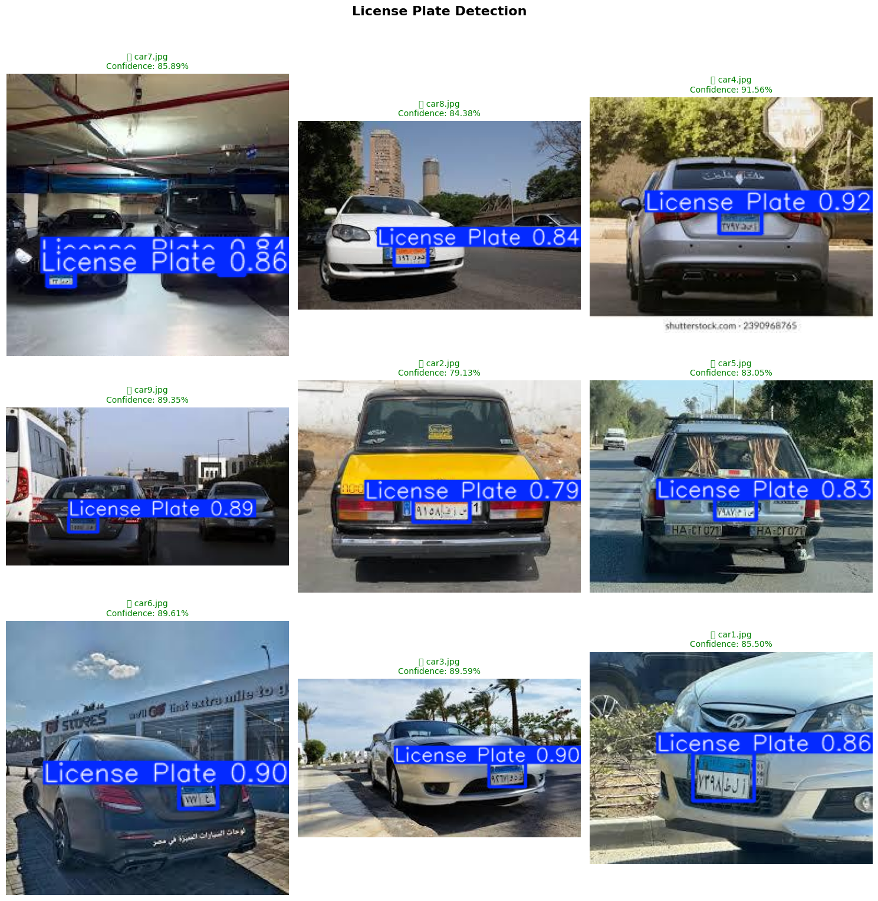
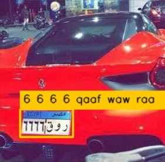

# Egyptian Plate Detector V2

> **A two-stage YOLO pipeline for detecting and recognizing Egyptian Arabic license plates.**

---

## Overview

This project implements an end-to-end **Automatic License Plate Recognition (ALPR)** system tailored specifically for Egyptian license plates, which feature Arabic characters and digits.

The system operates as a **two-stage pipeline**:

1. **Stage 1: Plate Detection** : A custom-trained YOLOv8 model localizes the license plate within the vehicle image and returns its bounding box coordinates.
2. **Stage 2: Character Recognition** : A second custom-trained YOLOv8 model identifies each Arabic character on the cropped plate individually, sorts them left to right, maps them to proper Arabic script, and reconstructs the full plate text.

The final output is the annotated image with a bounding box drawn around the detected plate, along with the recognized Arabic plate text and confidence score.

---

## Project Structure

```
Egyptian-Plate-Detector-V2/
├── api/
│   ├── app.py          # FastAPI application & endpoint
│   ├── schemas.py      # Pydantic response models
│   ├── services.py     # Pipeline orchestration
│   └── utils.py        # Core detection & recognition functions
├── Models/
│   ├── plate_detector.pt
│   └── char_recognizer.pt
├── Models_Training/    # Training notebooks
├── images/             # Sample prediction images
├── requirements/       # Lists project dependencies.
└── main.py             # Standalone inference script

```

---

## Datasets

The two models were trained on the following datasets:

- **Plate Detection Dataset**: [Dataset Link 1](https://datasetninja.com/ealpr-vehicles)
- **Character Recognition Dataset**: [Dataset Link 2](https://universe.roboflow.com/alyalsayed-vyx6g/egyptian-car-plates)

---

## Model Performance

### Stage 1 · Plate Detector

| Metric | Score |
|---|---|
| mAP@50 | **0.9950** |
| mAP@50-95 | **0.9141** |
| Precision | **0.9950** |
| Recall | **0.9905** |

---

### Stage 2 · Character Recognizer

| Metric | Score |
|---|---|
| mAP@50 | **0.9882** |
| mAP@50-95 | **0.6645** |
| Precision | **0.9777** |
| Recall | **0.9894** |

---

## Sample Predictions

### Plate Detection
> The model localizes the license plate within the vehicle image.



---

### Character Recognition
> The model identifies each Arabic character on the cropped plate.



---

## Installation

```bash
git clone https://github.com/Ahmed482-21albadawy/Egyptian-Plate-Detector-V2.git
cd Egyptian-Plate-Detector-V2
pip install -r requirements.txt
```

---

## Usage

### Standalone inference

```bash
python main.py
```

### Run the API

```bash
uvicorn api.app:app --reload
```

Then send a POST request to:

```
POST /detect/image
```

with a car image as `multipart/form-data`.

---

## Built With

- [YOLOv8](https://github.com/ultralytics/ultralytics) - Object detection backbone
- [OpenCV](https://opencv.org/) - Image processing
- [FastAPI](https://fastapi.tiangolo.com/) - API framework
